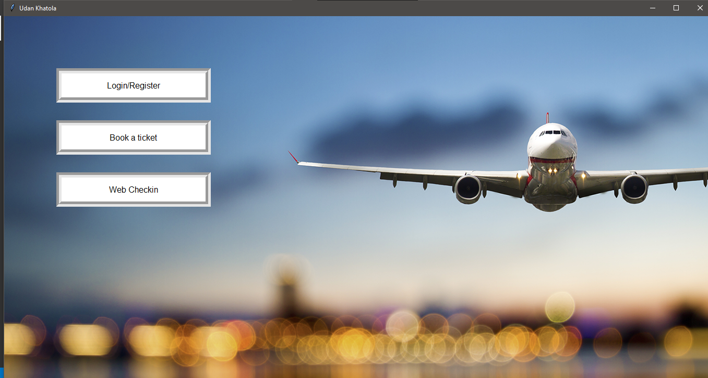
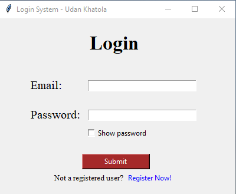
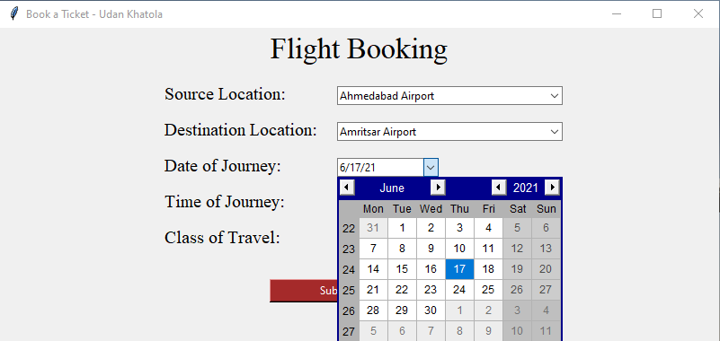
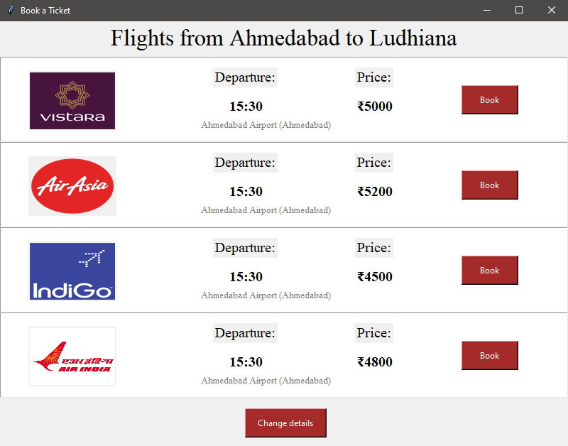
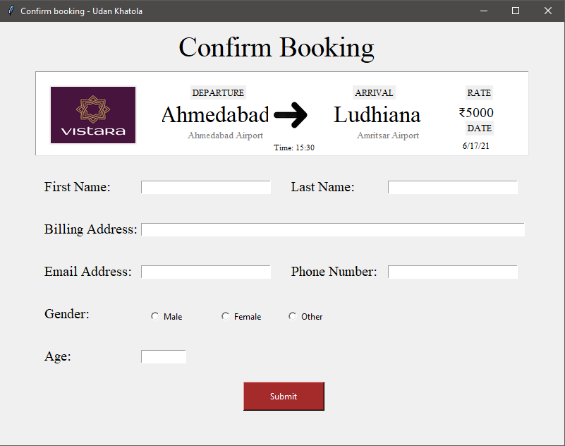
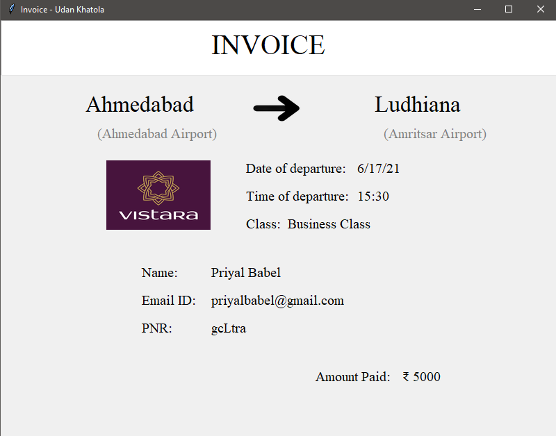
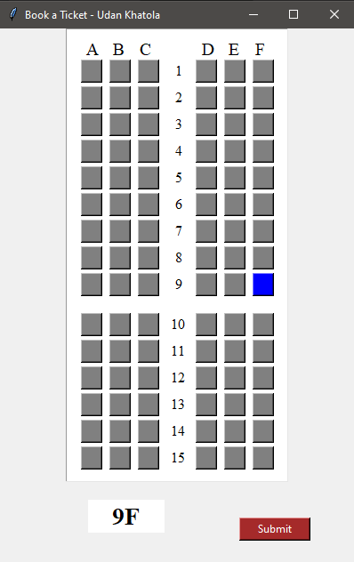
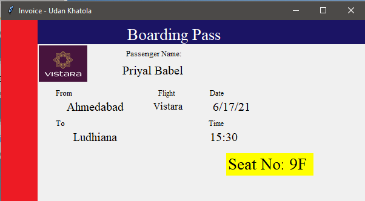

# Udan-Khatola
Airline Reservation System using Tkinter and MySQL
## Tech Stack
[](https://www.python.org/)
### Database


## Packages used
○ Tkinter  ○ MySQLdb  ○ Pillow  ○ Datetime  ○ Json  ○ String  ○ Random  ○ Tkcalendar

## Instructions
- Clone
```
$ git clone https://github.com/priyal-babel/Udan-Khatola.git
```
- Install python packages
```
$ pip install tk
$ pip install mysqlclient
$ pip install Pillow
$ pip install DateTime
$ pip install json
$ pip install tkcalendar
```
- Create a file named configure.py in [database](https://github.com/priyal-babel/Udan-Khatola/tree/main/database) and [scripts](https://github.com/priyal-babel/Udan-Khatola/tree/main/scripts) folders.
- In configure.py copy and paste the below code
```
user = 'database_user'
password = 'password'
```
  Where, database_user should be replaced by name of your MySQL root user and password by your MySQL password.
- First, run [register.py](https://github.com/priyal-babel/Udan-Khatola/blob/main/database/register.py)
- Then run [base.py](https://github.com/priyal-babel/Udan-Khatola/blob/main/scripts/base.py)
## Features of Udan-Khatola
1. Login/Register
2. Web checkin
3. Ticket Booking
4. Access Past Bookings
---
<h2 align="center">
Screenshots of the project
</h2>


<div align="center">
<div>
  
  
</div>
  <br>
 <div>
  
  
 </div>
  <br>

<br>
<div>
  
  
</div>

</div>

---
